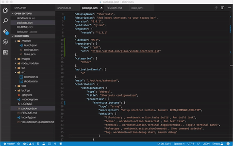

# Shortcuts

Shortcuts let you add useful icons to the bottom status bar. You can add/edit your own icon appearance, command and tooltip by changing the pre-defeind settings (no code needed!).   

## Features

Commands' shortcuts:



## Requirements

Latest version of VSCode would be enough.

## Extension Settings

This extension contributes the following settings:

* `shortcuts.buttons`: define configurable buttons. Format: `icon, command, tooltip`. Default settings:

  ```json
  [
    "file-binary , workbench.action.tasks.build , Run build task",
    "beaker , workbench.action.tasks.test , Run test task",
    "terminal , workbench.action.terminal.toggleTerminal , Toggle terminal panel",
    "telescope , workbench.action.showCommands , Show command palette",
    "bug, workbench.action.debug.start, Launch debug"
  ]
  ```

Go to preference > workspace settings to change these settings. The changes will be automatically loaded up after VSCode restart.

## Known Issues

Please see: [issues](https://github.com/gizak/vscode-shortcuts/issues).

## Release Notes

### 0.0.1

Initial release
